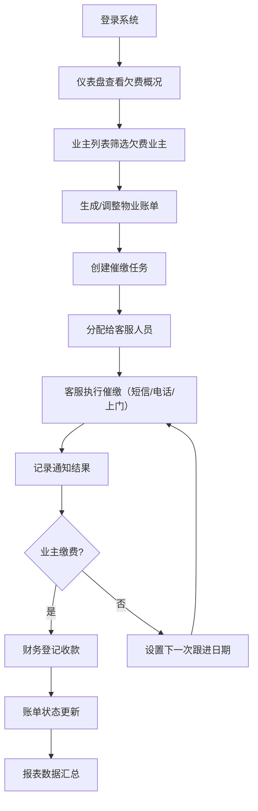

## 1. 产品概述

物业费催缴管理系统，专为小区物业财务人员和客服人员设计的桌面端 Web 应用，用于高效处理业主欠费跟进、账单管理、催缴任务分配和收款登记等核心业务流程，提升物业费收缴率和工作效率。

- **目标用户**：物业财务人员、客服专员、物业主管
- **核心价值**：可视化欠费数据、标准化催缴流程、规范化收款管理、多维度统计报表

## 2. 核心功能

### 2.1 用户角色

| 角色 | 登录方式 | 核心权限 |
|------|---------|---------|
| 财务人员 | 账号密码登录 | 账单生成/调整/作废、收款登记、报表导出、仪表盘查看 |
| 客服专员 | 账号密码登录 | 催缴任务处理、通知记录查看、业主信息查看 |
| 物业主管 | 账号密码登录 | 全部权限、任务分配、数据统计分析 |

### 2.2 功能模块

1. **仪表盘**：欠费概览卡片、楼栋欠费分布、催缴进度、待办任务提醒
2. **业主列表**：业主信息管理、多条件筛选、欠费明细查看
3. **账单管理**：费用生成、账单调整、账单作废、批量操作
4. **催缴任务**：任务分配、跟进设置、任务状态追踪、优先级管理
5. **通知记录**：短信记录、电话记录、上门记录、结果统计
6. **收款登记**：缴费录入、部分缴费、费用减免、收款凭证
7. **统计报表**：按楼栋汇总、按月份统计、按人员考核、报表导出

### 2.3 页面详情

| 页面名称 | 模块名称 | 功能描述 |
|---------|---------|---------|
| 仪表盘 | 数据概览卡片 | 展示欠费总金额、欠费户数、催缴完成率、本月收款额 |
| 仪表盘 | 楼栋欠费排行 | 柱状图展示各楼栋欠费金额排名 Top 10 |
| 仪表盘 | 催缴进度趋势 | 折线图展示近 6 个月催缴进度变化 |
| 仪表盘 | 待办任务列表 | 展示今日到期的催缴任务和待处理通知 |
| 业主列表 | 筛选区 | 按楼栋、房号、欠费月数、业主姓名筛选搜索 |
| 业主列表 | 业主表格 | 展示业主基本信息、联系方式、欠费金额、欠费月数、状态标签 |
| 业主列表 | 详情抽屉 | 查看业主完整信息、历史账单、催缴记录 |
| 账单管理 | 账单列表 | 展示账单编号、业主信息、费用明细、账单状态、生成时间 |
| 账单管理 | 生成账单 | 选择时间段、费用类型，支持批量生成物业费账单 |
| 账单管理 | 调整账单 | 修改费用金额、添加调整备注、记录调整原因 |
| 账单管理 | 作废账单 | 作废操作、作废原因必填、操作人留痕 |
| 催缴任务 | 任务列表 | 展示任务编号、业主、类型、负责人、截止日期、状态 |
| 催缴任务 | 分配任务 | 选择客服人员、设置跟进日期、添加任务备注 |
| 催缴任务 | 任务详情 | 查看任务历史、添加跟进记录、更新任务状态 |
| 通知记录 | 记录列表 | 按类型（短信/电话/上门）筛选、展示通知时间、结果、操作人 |
| 通知记录 | 统计卡片 | 展示各类型通知数量、成功率分布 |
| 收款登记 | 收款列表 | 展示收款单号、业主、金额、方式、时间、操作人 |
| 收款登记 | 新增收款 | 录入缴费金额（支持部分缴费）、选择支付方式、添加减免备注 |
| 收款登记 | 收款详情 | 查看收款凭证、关联账单、打印收据 |
| 统计报表 | 楼栋汇总 | 按楼栋统计欠费户数、欠费金额、收缴率、排名 |
| 统计报表 | 月份统计 | 按月份展示应收、实收、欠费、收缴率趋势 |
| 统计报表 | 人员考核 | 按客服统计任务数、完成数、催缴成功率、收款额 |
| 统计报表 | 导出功能 | 支持 Excel/CSV 格式导出各类报表数据 |

## 3. 核心流程

### 3.1 欠费催缴主流程

财务人员登录系统后，首先在仪表盘查看整体欠费情况和待办任务。根据欠费数据筛选出目标业主，生成对应账单后分配催缴任务给客服人员。客服接收任务后通过短信/电话/上门等方式进行催缴，并记录通知结果。业主缴费后，财务在系统中登记收款信息，系统自动更新账单状态和催缴进度。主管可通过统计报表随时查看各维度的业务数据。

## 4. 用户界面设计

### 4.1 设计风格

- **主色调**：深靛蓝（#1e3a5f）作为主色，体现专业、稳重的企业级应用气质
- **辅助色**：琥珀色（#f59e0b）用于提醒和警告，翠绿（#10b981）用于成功和收款，珊瑚红（#ef4444）用于欠费和紧急
- **中性色**：石板灰系列（slate）作为背景、边框和文字颜色，层次分明
- **按钮风格**：圆角 8px，带微妙阴影，hover 时有上浮和颜色加深效果
- **字体**：中文使用「思源宋体」搭配「等线」作为正文字体，标题使用更粗的字重营造层级感
- **布局风格**：左侧固定导航栏 + 顶部操作栏 + 主体卡片式内容区，采用大量留白和微妙分隔线
- **图标风格**：使用 Lucide 图标库，线条风格统一，尺寸 18-24px

### 4.2 页面设计概览

| 页面名称 | 模块名称 | UI 元素 |
|---------|---------|---------|
| 仪表盘 | 数据卡片 | 渐变背景、大号数字、趋势箭头、小图标装饰、hover 上浮动画 |
| 仪表盘 | 图表区 | 卡片包裹、图表标题、图例、渐变柱状/折线 |
| 仪表盘 | 待办列表 | 时间轴样式、状态徽章、优先级标签 |
| 业主列表 | 筛选区 | 标签式筛选器、下拉选择、搜索框、重置按钮 |
| 业主列表 | 数据表格 | 斑马纹、固定表头、状态颜色标签、行 hover 高亮 |
| 业主列表 | 详情抽屉 | 右侧滑入、分组信息、分割线、操作按钮组 |
| 账单管理 | 操作栏 | 左侧标题 + 右侧主操作按钮组（生成/调整/作废） |
| 账单管理 | 模态框 | 居中弹窗、表单分组、确认/取消按钮 |
| 催缴任务 | 看板视图 | 按状态分列卡片、拖拽感、优先级色块 |
| 收款登记 | 表单 | 分组布局、金额输入大字号、减免开关、支付方式单选卡片 |
| 统计报表 | Tab 切换 | 下划线式 Tab、内容区卡片、导出按钮悬浮 |

### 4.3 响应式设计

- **设计优先级**：桌面端优先（默认 1440px 宽度），适配 1280px ~ 1920px 常见分辨率
- **大屏适配**：内容区最大宽度 1600px 居中，两侧留白，表格列宽自适应
- **中屏适配**：1280px 时导航栏图标模式，表格支持横向滚动
- **不做移动端**：本系统为内部办公系统，主要在电脑端使用，无需适配移动端

### 4.4 动效与交互

- **页面进入**：顶部栏先出现（100ms），然后内容卡片依次上移淡入（stagger 50ms）
- **按钮交互**：hover 时 translateY(-1px) + 阴影加深，active 时轻微回弹
- **抽屉/模态框**：backdrop 淡入 150ms，内容滑入 200ms（ease-out）
- **数据刷新**：loading 骨架屏（animate-pulse），数据到位后淡入
- **表格行**：hover 时背景色过渡 150ms，行内操作按钮渐显
