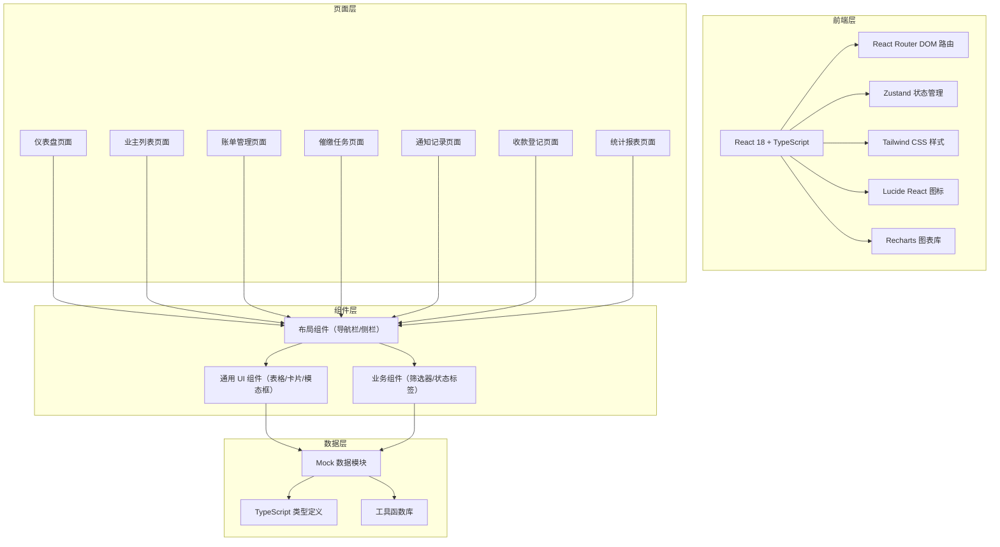
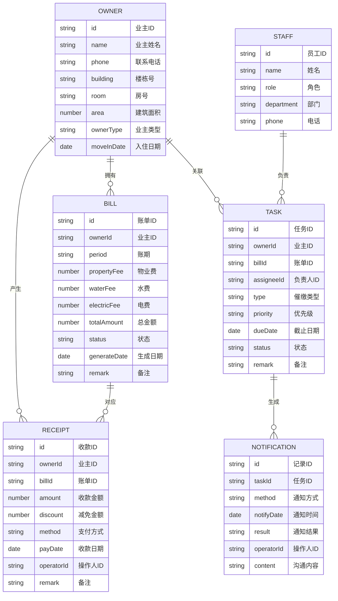

## 1. 架构设计



## 2. 技术说明

- **前端框架**：React@18 + TypeScript@5
- **构建工具**：Vite@5
- **路由管理**：react-router-dom@6
- **样式方案**：tailwindcss@3
- **状态管理**：zustand@4
- **图表库**：recharts@2
- **图标库**：lucide-react@latest
- **日期处理**：date-fns@3（轻量级日期工具）
- **后端**：无后端，使用 Mock 数据模拟业务逻辑
- **数据持久化**：localStorage 模拟数据持久化

## 3. 路由定义

| 路由路径 | 页面名称 | 说明 |
|---------|---------|------|
| `/` | 仪表盘 | 系统首页，数据概览 |
| `/owners` | 业主列表 | 业主信息管理 |
| `/bills` | 账单管理 | 费用生成与管理 |
| `/tasks` | 催缴任务 | 任务分配与跟进 |
| `/notifications` | 通知记录 | 催缴历史记录 |
| `/receipts` | 收款登记 | 收款录入与查询 |
| `/reports` | 统计报表 | 多维度数据报表 |

## 4. 数据模型

### 4.1 实体关系图



### 4.2 TypeScript 类型定义

```typescript
// 业主信息
interface Owner {
  id: string;
  name: string;
  phone: string;
  building: string;
  room: string;
  area: number;
  ownerType: '住宅' | '商铺';
  moveInDate: string;
  unpaidMonths: number;
  unpaidAmount: number;
  status: 'normal' | 'arrears' | 'serious';
}

// 账单信息
interface Bill {
  id: string;
  ownerId: string;
  ownerName: string;
  building: string;
  room: string;
  period: string;
  propertyFee: number;
  waterFee: number;
  electricFee: number;
  otherFee: number;
  totalAmount: number;
  paidAmount: number;
  status: 'unpaid' | 'partial' | 'paid' | 'void';
  generateDate: string;
  dueDate: string;
  remark?: string;
}

// 催缴任务
interface Task {
  id: string;
  ownerId: string;
  ownerName: string;
  ownerPhone: string;
  building: string;
  room: string;
  billId?: string;
  assigneeId?: string;
  assigneeName?: string;
  type: 'sms' | 'call' | 'visit';
  priority: 'low' | 'medium' | 'high' | 'urgent';
  dueDate: string;
  status: 'pending' | 'in_progress' | 'completed' | 'cancelled';
  unpaidAmount: number;
  createDate: string;
  remark?: string;
}

// 通知记录
interface Notification {
  id: string;
  taskId?: string;
  ownerId: string;
  ownerName: string;
  method: 'sms' | 'call' | 'visit';
  notifyDate: string;
  result: 'success' | 'failed' | 'pending' | 'promised';
  operatorId: string;
  operatorName: string;
  content: string;
}

// 收款记录
interface Receipt {
  id: string;
  ownerId: string;
  ownerName: string;
  building: string;
  room: string;
  billId?: string;
  amount: number;
  discount: number;
  method: 'cash' | 'wechat' | 'alipay' | 'bank' | 'card';
  payDate: string;
  operatorId: string;
  operatorName: string;
  remark?: string;
}

// 员工信息
interface Staff {
  id: string;
  name: string;
  role: 'finance' | 'service' | 'manager';
  department: string;
  phone: string;
}
```

## 5. 项目目录结构

```
c:\TraeProjects\1014
├── .trae/
│   └── documents/
│       ├── PRD.md
│       └── TECH_ARCHITECTURE.md
├── src/
│   ├── components/          # 通用组件
│   │   ├── layout/         # 布局组件
│   │   │   ├── Sidebar.tsx
│   │   │   ├── Topbar.tsx
│   │   │   └── Layout.tsx
│   │   ├── ui/           # UI基础组件
│   │   │   ├── Card.tsx
│   │   │   ├── Button.tsx
│   │   │   ├── DataTable.tsx
│   │   │   ├── Modal.tsx
│   │   │   ├── Drawer.tsx
│   │   │   ├── StatusBadge.tsx
│   │   │   ├── SearchFilter.tsx
│   │   │   └── StatCard.tsx
│   │   └── business/     # 业务组件
│   │       ├── OwnerDetail.tsx
│   │       ├── BillActions.tsx
│   │       └── TaskCard.tsx
│   ├── pages/             # 页面组件
│   │   ├── Dashboard.tsx
│   │   ├── Owners.tsx
│   │   ├── Bills.tsx
│   │   ├── Tasks.tsx
│   │   ├── Notifications.tsx
│   │   ├── Receipts.tsx
│   │   └── Reports.tsx
│   ├── store/             # 状态管理
│   │   └── index.ts
│   ├── data/              # Mock数据
│   │   ├── mockData.ts
│   │   └── initialData.ts
│   ├── types/             # 类型定义
│   │   └── index.ts
│   ├── utils/             # 工具函数
│   │   ├── format.ts
│   │   └── helpers.ts
│   ├── App.tsx
│   ├── main.tsx
│   └── index.css
├── index.html
├── package.json
├── vite.config.ts
├── tsconfig.json
├── tailwind.config.js
├── postcss.config.js
└── README.md
```

## 6. 状态管理设计

使用 Zustand 创建单一 Store，包含以下状态切片：

```typescript
interface AppStore {
  // 业主相关
  owners: Owner[];
  selectedOwner: Owner | null;
  setSelectedOwner: (owner: Owner | null) => void;

  // 账单相关
  bills: Bill[];
  addBill: (bill: Bill) => void;
  updateBill: (id: string, data: Partial<Bill>) => void;
  voidBill: (id: string, reason: string) => void;

  // 任务相关
  tasks: Task[];
  addTask: (task: Task) => void;
  assignTask: (id: string, assigneeId: string, dueDate: string) => void;
  updateTaskStatus: (id: string, status: Task['status']) => void;

  // 通知相关
  notifications: Notification[];
  addNotification: (notification: Notification) => void;

  // 收款相关
  receipts: Receipt[];
  addReceipt: (receipt: Receipt) => void;

  // 员工相关
  staffs: Staff[];

  // 筛选状态
  filters: {
    building?: string;
    keyword?: string;
    status?: string;
  };
  setFilters: (filters: Partial<AppStore['filters']>) => void;
}
```
